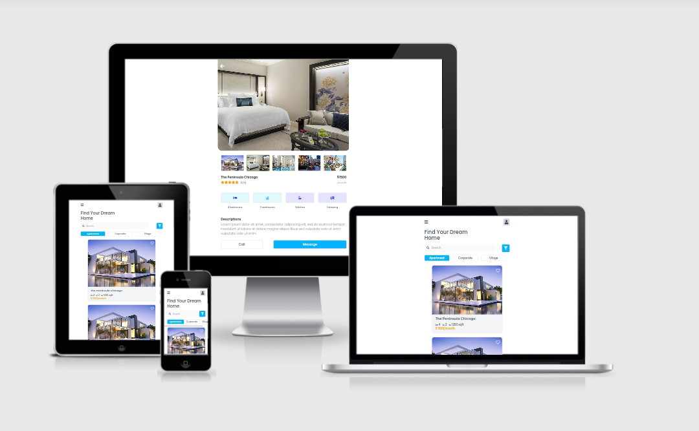

<h3 align="center">HOUSE FINDER APP</h3>

Slicing project #01

### About
This is my projects to make UI using front end tech 

Where the ideas and the concept i use from any other designer UI/UX from Instagram or Dribbble

### Languages and Tools
- Vue Js 3
- Tailwind
- Google Font
- FontAwesome
- Termux
- Vite Js
- Acode code editor

### Responsive Test
Test via [Am I Responsive](http://ami.responsivedesign.is/)

### Install Vite JS
- <code>npm init vite@latest</code>
- [See documentation](https://vitejs.dev/guide/)

### Clone This Repo
- <code>git clone https://github.com/or-abdillh/house-finder-app.git </code>
- <code>cd travel-app-2</code>
- <code>npm install</code>
- <code>npm run dev</code>
- if you get an <b>error on esbuild</b> try to install manual, run this code before <code>npm run dev</code> : 
- <code>node node_modules/esbuild/install.js</code> to install manually

### Demo 
- [House Finder App](https://house-finder-app-48udexwkc-or-abdillh.vercel.app)
- [Reels Instagram](https://www.instagram.com/reel/CT-DtYYF6Gi/?utm_medium=copy_link)

[Oka R Abdillah ](http://github.com/or-abdillh)
 
Last edited on : 19/9/2021